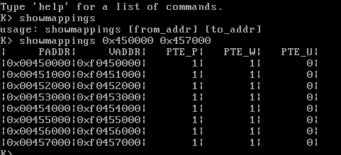
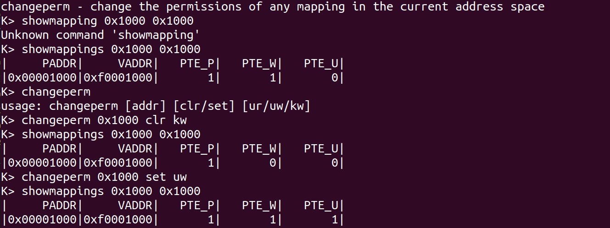
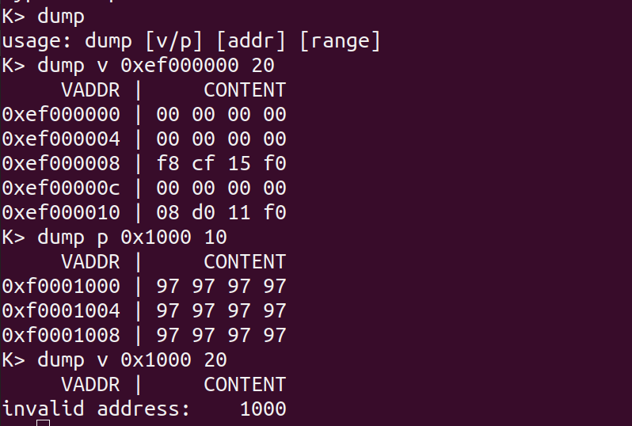

# lab2

516030910101 罗宇辰


------

### Questions

#### 1：

x should be  `uintptr_t`

#### 2：

| Entry | Base Virtual Address | Points to (logically):                |
| ----- | -------------------- | ------------------------------------- |
| 1023  | 0xFFC00000           | Page table for top 4MB of phys memory |
| ...   | ...                  | ...                                   |
| 960   | 0xF0000000           | Page table for remapped phys memory   |
| 959   | 0xEFC00000           | CPU Kernel Stack                      |
| 957   | 0xEF400000           | Current page table                    |
| 956   | 0xEF000000           | Read-Only Pages                       |
| ...   | ...                  | ...                                   |
| 0     | 0x00000000           | Empty memory(*)                       |

#### 3：

(From Lecture 3) We have placed the kernel and user environment in the same address space. Why will user programs not be able to read or write the kernel's memory? What specific mechanisms protect the kernel memory?

因为在映射KERNBASE的时候，PDE的permission bit PTE_U被设置为0，所以用户没有对kermel memory的读写权限

#### 4：

What is the maximum amount of physical memory that this operating system can support? Why?

根据`Physical memory: 131072K available, base = 640K, extended = 130432K`来看，最大的physical memory的大小就是`131072K`，即`128M`大小的内存。

因为可用的物理页的需要被映射成虚拟地址才能被管理和使用。

#### 5：

How much space overhead is there for managing memory, if we actually had the maximum amount of physical memory? How is this overhead broken down?

- page directory: `1` page = 4 KB
- page table: (4KB / 4 byte) page = 4 MB
- pages ： npages * sizeof（struct PageInfo）=  32768 * 16 byte = 512 KB 

可见页表占用了很大的空间

如果使用大页，就可以省下页表的空间，但可能造成浪费

#### 6：

Revisit the page table setup in `kern/entry.S` and `kern/entrypgdir.c`. Immediately after we turn on paging, EIP is still a low number (a little over 1MB). At what point do we transition to running at an EIP above KERNBASE? What makes it possible for us to continue executing at a low EIP between when we enable paging and when we begin running at an EIP above KERNBASE? Why is this transition necessary?

```asm
# entry.S

	# Now paging is enabled, but we're still running at a low EIP
	# (why is this okay?).  Jump up above KERNBASE before entering
	# C code.
	mov	$relocated, %eax
	jmp	*%eax

```

```c
// entrypgdir.c

__attribute__((__aligned__(PGSIZE)))
pde_t entry_pgdir[NPDENTRIES] = {
	// Map VA's [0, 4MB) to PA's [0, 4MB)
	[0]
		= ((uintptr_t)entry_pgtable - KERNBASE) + PTE_P,
	// Map VA's [KERNBASE, KERNBASE+4MB) to PA's [0, 4MB)
	[KERNBASE>>PDXSHIFT]
		= ((uintptr_t)entry_pgtable - KERNBASE) + PTE_P + PTE_W
};
```

由于一开始把虚拟地址`[0, 4MB]`和`[KERNBASE, KERNBASE+4MB]`都映射到物理地址`[0,4MB]`处，在页表没有使用时，使用的是低地址空间对应的物理地址，在开启paging之后，映射的也是同一块物理空间，所以尽管`EIP`的值变了，还是可以连续执行。

这样的一个切换就可以把低地址空间留给user使用，把kernel放在高地址空间

------

### Challenge

#### 1. showmappings

- usage: `showmappings [from_addr] [to_addr]`



```c
int 
mon_showmappings(int argc, char **argv, struct Trapframe *tf){
	if(argc != 3){
		cprintf("usage: showmappings [from_addr] [to_addr]\n",argc);
		return 0;
	}
	physaddr_t from = ROUNDDOWN(strtol(argv[1],NULL, 16),PGSIZE);
	physaddr_t to = ROUNDUP(strtol(argv[2],NULL, 16),PGSIZE);

	cprintf("|%10s|%10s|%8s|%8s|%8s|\n","PADDR","VADDR","PTE_P","PTE_W","PTE_U");
	for(physaddr_t i=from;i<=to;i+=PGSIZE){
		void* va = KADDR(i);
		cprintf("|0x%08x|0x%08x|", i, va);
		pte_t* pte = pgdir_walk(kern_pgdir, va, 0);
		if(pte){
			cprintf("%8x|%8x|%8x|\n", (*pte & PTE_P)>0, (*pte & PTE_W)>0,(*pte & PTE_U)>0);
		}
		else{
			cprintf("%8x|%8x|%8x|\n", 0, 0, 0);
		}
	}
	return 0;
}
```

#### 2. change permission

- usage: `changeperm [addr] [clr/set] [ur/uw/kw]`



```c
int 
mon_changeperm(int argc, char **argv, struct Trapframe *tf){
	if(argc != 4){
		cprintf("usage: changeperm [addr] [clr/set] [ur/uw/kw]\n",argc);
		return 0;
	}
	
	physaddr_t addr = strtol(argv[1],NULL, 16);
	char* type = argv[2];
	char* perm = argv[3];
	
	void* va = KADDR(addr);
	pte_t* pte = pgdir_walk(kern_pgdir, va, 0);
	if(!pte){
		cprintf("invalid addr:%8x\n",addr);
		return 0;
	}
	

	if(!strcmp(type,"clr")){		
		if(!strcmp(perm, "ur") || !strcmp(perm, "uw")){
			*pte = (*pte) & ~PTE_U;
		}
		else if(!strcmp(perm, "kw")){
			*pte = (*pte) & ~PTE_W;
		}
		else{
			cprintf("invalid permisson:%4s\n",perm);
		}
		return 0;
	}
	else if(!strcmp(type,"set")){		
		if(!strcmp(perm, "ur")){
			*pte = (*pte) | PTE_U;
		}
		else if(!strcmp(perm, "uw")){
			*pte = (*pte) | PTE_U | PTE_W;
		}
		else if(!strcmp(perm, "kw")){
			*pte = (*pte) | PTE_W;
		}
		else{
			cprintf("invalid permisson:%4s\n",perm);
		}
		return 0;
	}
	else{
		cprintf("invalid action:%4s\n",type);
	}

	
	return 0;
```

#### 3. dump

- usage: `dump [v/p] [addr] [range]`



```c
int 
mon_dump(int argc, char **argv, struct Trapframe *tf){
	if(argc != 4){
		cprintf("usage: dump [v/p] [addr] [range]\n",argc);
		return 0;
	}

	char* type = argv[1];
	uint32_t range = strtol(argv[3], NULL, 10);

	uintptr_t va = 0;
	if(!strcmp(type, "p")){//physical addr
		va = (uintptr_t)KADDR(strtol(argv[2],NULL,16));
	}
	else if(!strcmp(type, "v")){//virtual addr
		va = strtol(argv[2],NULL,16);
	}
	else{
		cprintf("invalid address type:%4s\n",type);
		return 0;
	}

	va = ROUNDDOWN(va, sizeof(uint32_t));
	uintptr_t va_to = ROUNDUP(va+range,sizeof(uint32_t));
	cprintf("%10s |%12s\n","VADDR","CONTENT");
	for(;va<va_to;va+=sizeof(uint32_t)){
		pte_t* pte = pgdir_walk(kern_pgdir,(void*)va,0);
		if(!pte || !(*pte & PTE_P)){
			cprintf("invalid address:%8x\n",va);
			break;
		}
		uint32_t cont = *(uint32_t*)va;
		cprintf("0x%8x | %02x %02x %02x %02x\n",va,(cont>>0)&0xFF,(cont>>8)&0xFF,(cont>>16)&0xFF,(cont>>24)&0xFF);
	}	
	return 0;
}
```

