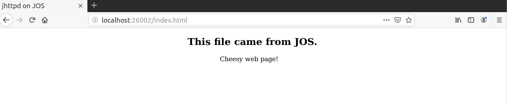
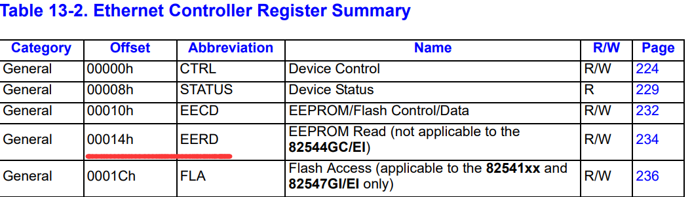
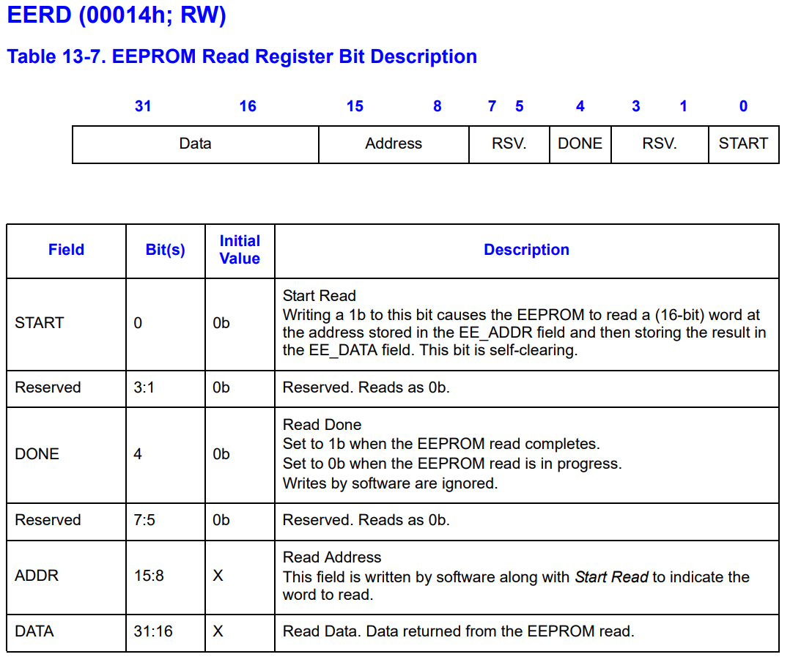

# Lab6

516030910101 罗宇辰

------

### Question

#### 1.

How did you structure your transmit implementation? In particular, what do you do if the transmit ring is full?

首先在`error.h`中定义一个error code `E_TX_FULL`，用来表示transmit ring为full的情况：

```c
enum {
    ...
    // E1000 error codes
	E_TX_FULL,		/* transmit ring is full */
    ...
};   
```

在`e1000_tx`中，当检测到full时，不进行处理，直接返回`-E_TX_FULL`：

```c
	uint32_t tdt = base->TDT;
	if(!(tx_descs[tdt].status & E1000_TX_STATUS_DD))
		return -E_TX_FULL;
```

`output`中发现full时，就会block住，等待server可以transmit的时候：

```c
	while((r=sys_net_send(nsipcbuf.pkt.jp_data, nsipcbuf.pkt.jp_len))<0){
		if(r != -E_TX_FULL)
			panic("[output] %e", r);
	}
```

#### 2.

How did you structure your receive implementation? In particular, what do you do if the receive queue is empty and a user environment requests the next incoming packet?

类似transmit过程，receive queue为empty时，server不进行处理，直接返回error code，而user端block住，等待有packet的时候

`e1000_rx`中：

```c
	uint32_t rdt = (base->RDT+1) % N_RXDESC;
	if(!(rx_descs[rdt].status & E1000_RX_STATUS_DD))
		return -E_AGAIN;
```

`input`中：

```c
	while((r = sys_net_recv(buf, 2048)) < 0){
		if(r != -E_AGAIN)
			panic("[input - sys_net_recv]:%e",r);
	}
```

#### 3.

What does the web page served by JOS's web server say?

*"Cheesy web page!"* 



#### 4.

 How long approximately did it take you to do this lab?

断断续续4天


### Challenge

> *Challenge!* Read about the EEPROM in the developer's manual and write the code to load the E1000's MAC address out of the EEPROM. Currently, QEMU's default MAC address is hard-coded into both your receive initialization and lwIP. Fix your initialization to use the MAC address you read from the EEPROM, add a system call to pass the MAC address to lwIP, and modify lwIP to the MAC address read from the card. Test your change by configuring QEMU to use a different MAC address.

根据Mannual中的记录





在`struct E1000`中增加**EERD**项：

```c
struct E1000 {
	...
	volatile uint32_t EERD;				/* 0x00014  EEPROM Read Register - RW */
    ...
}
```

新增macro和mac地址变量 ：

```C
#define E1000_EERD_START	(1U)			/* Start Read */
#define E1000_EERD_DONE		(1U << 4)		/* Read Done */
uint8_t E1000_MAC[6];
```

定义了读取MAC地址的函数：

```c
static uint16_t
EEPROM_MAC(uint8_t addr)
{
	base->EERD |= E1000_EERD_START | (addr << 8);
	while(!(base->EERD & E1000_EERD_DONE));
	cprintf("[EEPROM_MAC] read %04x at addr %02x\n", base->EERD >> 16, addr);
	base->EERD &= ~E1000_EERD_DONE;
	return base->EERD >> 16;
}
```

在e1000_rx_init中使用EEPROM_MAC来读取MAC地址

```c
	//	Challenge!
	uint16_t MAC_LOW = EEPROM_MAC(0x0);
	uint16_t MAC_MID = EEPROM_MAC(0x1);
	uint16_t MAC_HIGH = EEPROM_MAC(0x2);

	E1000_MAC[0] = (MAC_LOW >> 0) & 0xFF;
	E1000_MAC[1] = (MAC_LOW >> 8) & 0xFF;
	E1000_MAC[2] = (MAC_MID >> 0) & 0xFF;
	E1000_MAC[3] = (MAC_MID >> 8) & 0xFF;
	E1000_MAC[4] = (MAC_HIGH >> 0) & 0xFF;
	E1000_MAC[5] = (MAC_HIGH >> 8) & 0xFF;
	

	cprintf("MAC address read from EEPROM: %02x:%02x:%02x:%02x:%02x:%02x\n",
			E1000_MAC[0], E1000_MAC[1],E1000_MAC[2],E1000_MAC[3],E1000_MAC[4],E1000_MAC[5]);

	base->RAH = MAC_HIGH | E1000_RAH_AV;
	base->RAL = (MAC_MID << 16) | MAC_LOW;	
```

增加新的syscall来改变MAC地址：

```c
// lab6 challenge
int 
sys_get_MAC(uint8_t* addr)
{
	memmove(addr, E1000_MAC, 6);

	return 0;
}
```

jif中调用syscall来改变写死的MAC地址：

```c
static void
low_level_init(struct netif *netif)
{
    int r;

    netif->hwaddr_len = 6;
    netif->mtu = 1500;
    netif->flags = NETIF_FLAG_BROADCAST;

	// MAC address is hardcoded to eliminate a system call
    // netif->hwaddr[0] = 0x52;
    // netif->hwaddr[1] = 0x54;
    // netif->hwaddr[2] = 0x00;
    // netif->hwaddr[3] = 0x12;
    // netif->hwaddr[4] = 0x34;
    // netif->hwaddr[5] = 0x56;

    if((r = sys_get_MAC(netif->hwaddr)) < 0)
        panic("[low_level_init - sys_get_MAC]: %e", r);
}
```